<!--
 readme编写规范：
  1. 所有readme都需要保留本说明且不可做任何翻译修改。主readme(中文版)是本说明的唯一源头(Source of Truth)，禁止将非中文版本中被修改的说明同步回主readme。非中文版的此说明需始终保持与主readme单向同步更新。
  2. 非中文版本的readme必须保留主readme(中文版)的所有视觉元素、HTML 标签、图标路径和排版格式，非中文版本的readme是中文版的完整对应精准同步翻译版，翻译不可笼统，不可修改原意，不可增减内容。
  3. 针对目标语言环境进行功能描述的本土化。
  4. 非中文版本的readme需要合理修改指向资源的路径，确保资源能够正确显示。
  5. 非中文版本的readme都需要保留并置顶本说明
  6. 非中文版本的readme都需要置顶以下元素，可以替换为相应的翻译版本但必须保留原意：
	    <div align="right">
	    <a href="../readme.md">For the latest updates, please refer to the Chinese README.</a>
	    </div>
  7. 任何关于项目内容的更新，必须首先在主readme(中文版)中完成。在主版确认无误后，再根据本规范同步至其他语言版本。
  8. 非中文版本的readme顶部的语言切换器仅保留指向主readme(中文版)的链接，不互相跳转。非中文版本的入口仅在主readme中统一显示。
-->
<div align="right">
  <a href="../../readme.md">For the latest updates, please refer to the Chinese README.</a>
</div>
<div align="center">
  

# Eric Game Launcher

**Bring Game Launching Back to Purity and Speed**


[](https://dotnet.microsoft.com/)
[](https://github.com/microsoft/microsoft-ui-xaml)
[](https://www.microsoft.com/windows)
[](https://www.gnu.org/licenses/gpl-3.0.html)

<a href="#highlights">Highlights</a> • <a href="#quickstart">Quick Start</a> • <a href="#features">Features</a> • <a href="#cli">CLI</a> • <a href="#settings">Settings</a> • <a href="#architecture">Architecture</a> • <a href="#faq">FAQ</a> • <a href="#thanks">Thanks</a>

<div align="center">
  
</div>

</div>

---

<a name="highlights"></a>

## Highlights

|  |  |
| :--- | :--- |
| 🚀 **Millisecond re-launch** | After sign-in, a background host pre-reads your configuration, validates and warms up icons and the interface, so opening the launcher again feels instant. Turn it off whenever you like — nothing is left behind. |
| 🧩 **End-to-end execution** | Five controllable paths — main program, manager, substitute launch, launch alongside, and custom context menu; plus EXE / LNK / URL protocol / web page / Store app targets, all of which can be elevated, given arguments, and use environment variables. |
| 🗑️ **Three-stage deletion** | Deleting in the main window only moves an item to the Recycle Bin; deleting it there starts a 72-hour countdown; once it expires, the item is purged on the next launch. You can restore at any point in between. |
| 🔍 **Find any game in a second** | Full Pinyin, Pinyin initials, Chinese, English and path matching. Type `yxlm` to jump straight to 英雄联盟 (League of Legends), or `部落` to reach 部落冲突 (Clash of Clans). |
| 🎒 **Fully portable** | Keep configuration and icon cache inside the program folder and carry your library on a USB drive. One click migrates between system and portable modes — no reconfiguration needed. |
| 💻 **Complete CLI** | Everything the desktop UI can do is available from the command line, with full documentation built into `-help` and the `skill` command for scripts and AI agents. |

<a name="quickstart"></a>

## Quick Start

### Requirements

| Item | Requirement |
| :--- | :--- |
| Operating system | Windows 11 24H2 (Build 26100) or later, x64 |
| Runtime | [.NET 10 Desktop Runtime](https://dotnet.microsoft.com/download/dotnet/10.0) and [Windows App Runtime 1.8](https://aka.ms/windowsappsdk/1.8/latest/windowsappruntimeinstall-x64.exe) (already present on most systems; install them if prompted) |
| Download size | About 13 MB. The launcher itself needs no installation — just extract and run |

### Three steps

1. **Download**: Grab the latest archive from [Releases](https://github.com/EricZhang233/EricGameLauncher/releases) and extract it anywhere (paths with spaces or non-ASCII characters are fine).
2. **Run**: Double-click `EricGameLauncher.exe`; initialization happens automatically on first launch. Want desktop and Start menu shortcuts as well? Run `install.cmd` instead.
3. **Fill your library**: Click **More → Scan** in the top-right corner to detect installed games and import them in one click, or use **More → Add** to point at an exe, shortcut, web page or Store app.

> 💡 Turn on **Settings → Quick Start** and the launcher warms up in the background after sign-in, so every later launch appears almost instantly.
>
> 💡 Prefer the command line? Run `EricGameLauncher.Cli.exe -help` for every command, or `EricGameLauncher.Cli.exe skill` for the agent integration guide.

---

<a name="features"></a>

## Features

### Every game in one grid

<div align="center">
  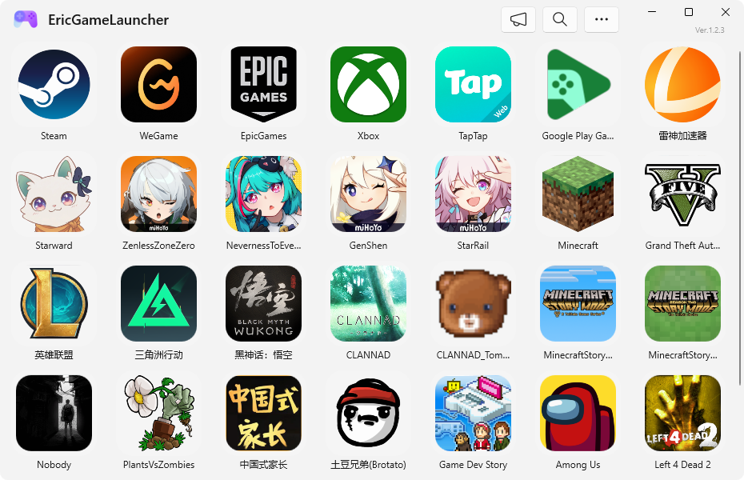
</div>

*   **No platform divide**: Steam, Epic Games, Xbox, WeGame, standalone executables, web links and Store apps all sit in the same grid, arranged however you like.
*   **Continuously adjustable icons**: From a compact list to an immersive large grid, the slider applies instantly and your choice is remembered.
*   **Multiple matching paths**: `yxlm` (Pinyin initials), `yingxionglianmeng` (full Pinyin), `部落` (Chinese) and `pcl` (path) all find their target.
*   **Fully manual ordering**: Reorder in **More → Sort** with the move buttons or the `W` `S` `↑` `↓` keys.
*   **Hover for details**: Rest the pointer for a moment and the full title appears — no more guessing long names.
*   **Single or double click**: Switch the launch gesture in Settings and play the way you prefer.

<div align="center">
  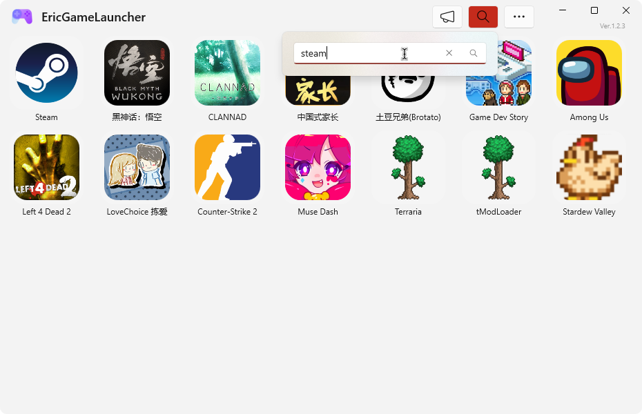
  <br/>
  <sub>Type Pinyin initials or a full Pinyin string to filter as you type</sub>
</div>

### End-to-end execution: more than a shortcut

<div align="center">
  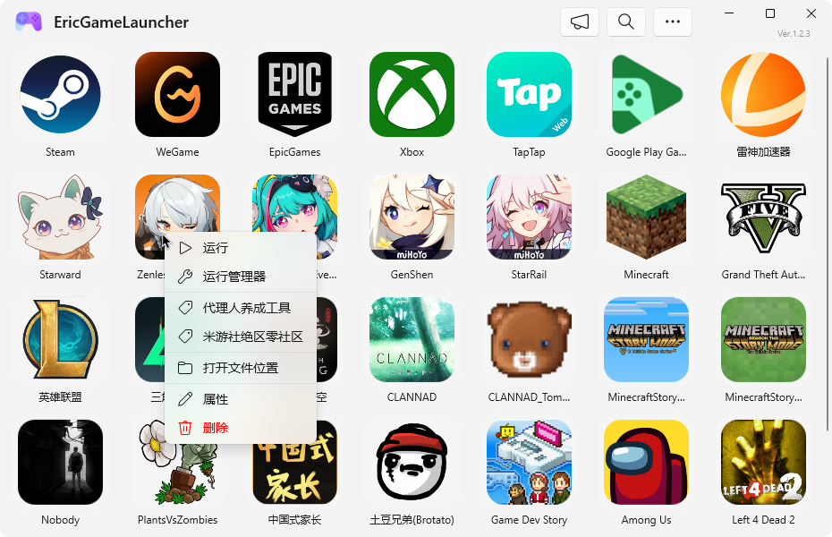
</div>

Configuring a game means configuring a complete launch chain:

| Capability | Description |
| :--- | :--- |
| **Main program** | Native `EXE`, `LNK` shortcuts, URL protocols such as `steam://` / `epic://` / `starward://`, web links, and `shell:AppsFolder\` Store apps. |
| **Run as administrator** | Elevate the main program and the manager separately to solve permission-related launch failures. |
| **Manager** | Configure the platform manager path separately so the game also brings up platform services correctly. |
| **Substitute launch** | Let a custom command (for example `starward://`) fully take over the original executable's launch logic. |
| **Launch alongside** | Open a translator, timer, performance monitor or key mapper together with the game in one click. |
| **Custom context menu** | Up to 10 custom entries per item, each with its own title, command, arguments and elevation flag; deleting a middle entry shifts the rest up automatically. |
| **Arguments and environment variables** | Every execution target accepts full arguments; variables such as `%AppData%` and `%LocalAppData%` expand automatically, and long paths with spaces need no manual quoting. |

### Quick Start: shrink the wait until it disappears

<div align="center">
  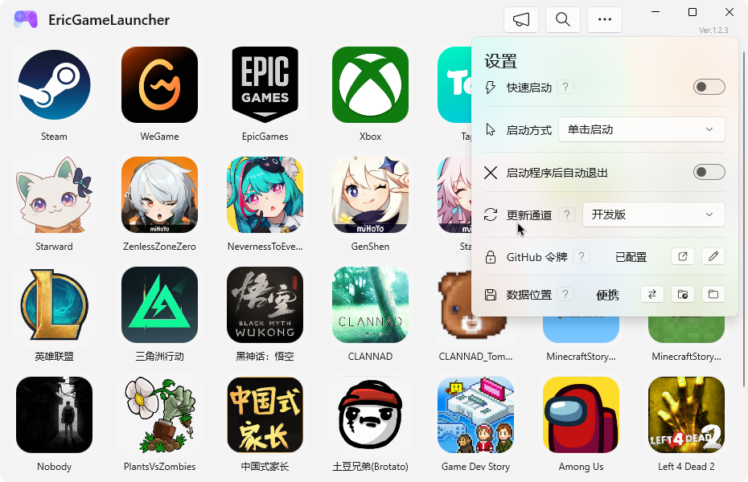
  <br/>
  <sub>Quick Start and the splash animation switches both live in Settings and can be turned off at any time</sub>
</div>

*   **Background host**: After sign-in a resident host pre-reads configuration and items, validates and rebuilds icons, completes a full warm-up pass of the interface, then releases it — leaving no window on screen.
*   **Opening it again feels instant**: The resources are already warm, so the window appears in a flash.
*   **Splash animation is optional**: Fade-in and fade-out can be toggled separately; when disabled the splash screen simply appears and disappears, making startup a little faster.
*   **Want it gone completely?** **More → Exit** ends both the window and the background host immediately without changing the Quick Start setting. On Windows 11 24H2 and later you can also right-click the taskbar entry and choose "End task".
*   **Don't want a background process?** Turn the switch off and the auto-start entry is removed right away.

### Property panel: every detail is editable

<div align="center">
  
  <br/>
  <sub>Main program, manager, substitute launch, alongside execution and up to 10 custom menu entries in one panel</sub>
</div>

*   **Display name and icon**: Rename anything at any time, or upload your own image as a cover.
*   **Paths laid out in fields**: Main program, manager, substitute launch and alongside execution are independent, each with a file picker and argument splitting.
*   **Visual custom menu editing**: Title, command and elevation flag line up in a column, up to 10 groups.
*   **Save takes effect immediately**: Changes are written to the local configuration and the interface refreshes on the spot.

### One-click scan across three platforms

<div align="center">
  
  <br/>
  <sub>Results are grouped into New / Existing / Invalid, ready for one-click import or batch cleanup</sub>
</div>

*   **Automatic discovery**: Natively detects games installed through Steam, Epic Games and Xbox (Microsoft Store / UWP), extracting paths and fetching icons.
*   **Grouped results**: Scan results are grouped into **New / Existing / Invalid**, and existing entries are never imported twice.
*   **One-click import**: Select all or pick individual entries; Steam protocol games automatically receive their `steam://` launch address.
*   **Invalid cleanup**: Games that were uninstalled or whose paths broke are listed together for batch removal.

### Three-stage deletion: a slip of the hand is still recoverable

<div align="center">
  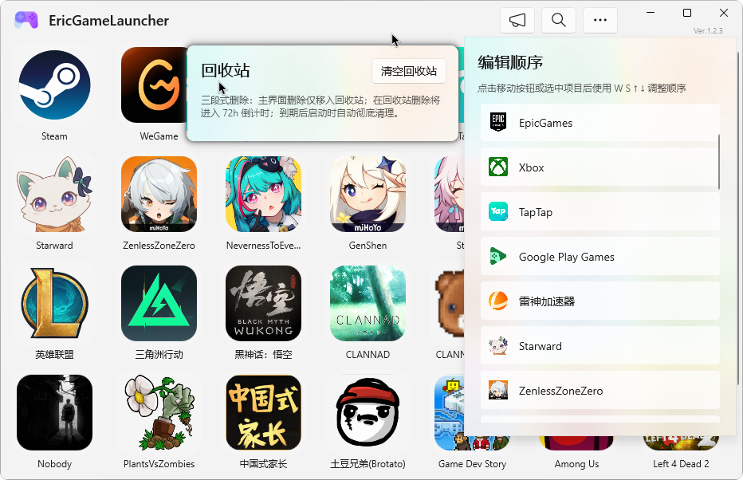
  <br/>
  <sub>Restore or permanently delete from the Recycle Bin; expired entries are purged on the next launch</sub>
</div>

| Stage | Behavior |
| :--- | :--- |
| Stage one | Delete in the main window → the item only moves to the Recycle Bin; the game is still there and can be restored at any time. |
| Stage two | Delete in the Recycle Bin → a 72-hour countdown starts and the remaining time is shown in the interface. |
| Stage three | The countdown ends → the item is purged automatically on the next launch. |

The Recycle Bin also supports emptying in one click, restoring individual items, and permanent deletion.

### Updates and announcements

<div align="center">
  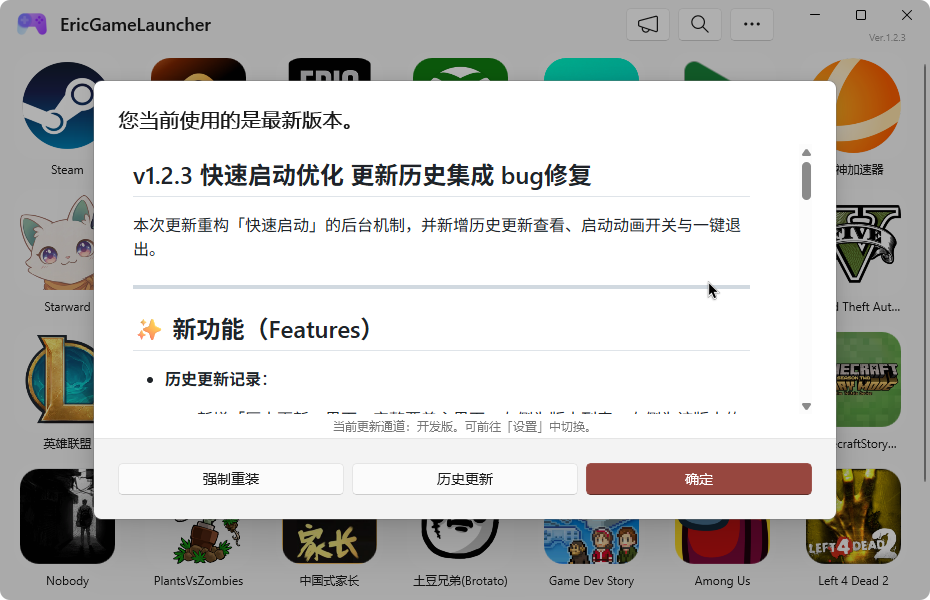
  <br/>
  <sub>When a new version appears you can update right away or open the full update history</sub>
</div>

<div align="center">
  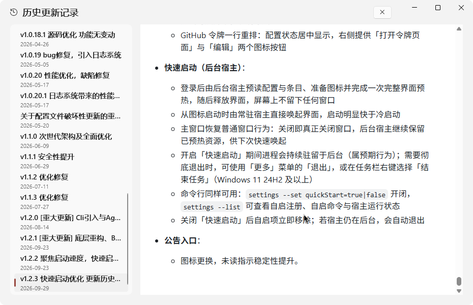
  <br/>
  <sub>Update history: version list on the left, complete notes on the right, with jump-to-version navigation</sub>
</div>

<div align="center">
  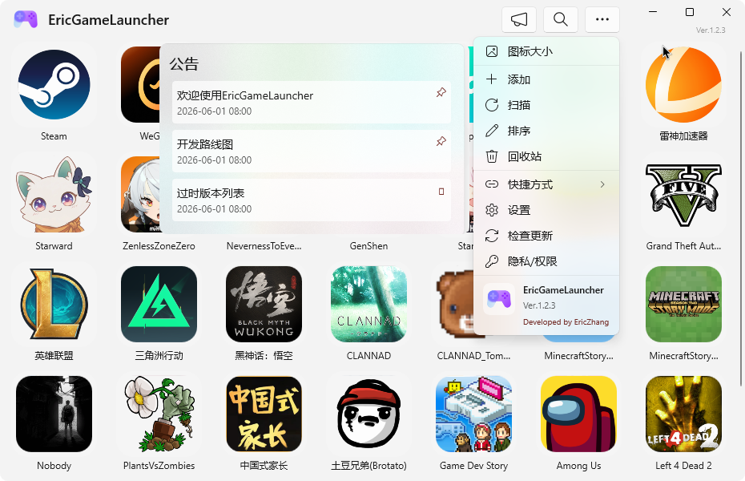
  <br/>
  <sub>The announcement flyout and the More menu: unread items carry a red dot and bodies support Markdown</sub>
</div>

*   **Silent update checks**: GitHub Releases is checked on startup; when a new version exists the version number turns red with an update icon — never an intrusive pop-up.
*   **Two channels**: **Stable** receives only official releases, while **Latest** gets new builds first.
*   **One-click download and install**: The launcher restarts and completes the replacement automatically; you can also force a reinstall whenever you want.
*   **Update history**: A version list on the left and the full notes on the right, with jump-to-any-version navigation, sourced from GitHub release records. The command line equivalent is `update --history`.
*   **Announcement center**: Cloud announcements are fetched on startup, the body supports Markdown, content is shown in Chinese and English, read state is persisted locally, and unread items carry a red dot.

<a name="settings"></a>

### Settings at a glance

<div align="center">
  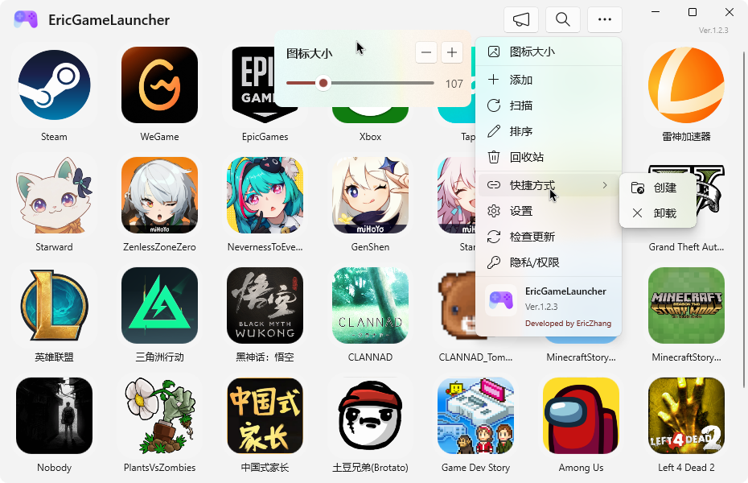
  <br/>
  <sub>The More menu: icon size adjusts live, and shortcuts can be created or removed in one click</sub>
</div>

*   **General**: Quick Start, splash animation (fade-in / fade-out), launch gesture (single / double click), and exit after launching.
*   **Updates**: update channel (stable / latest) and GitHub token (raises the API rate limit; the token is stored locally, encrypted with DPAPI).
*   **Data**: switch between portable and system storage with one-click migration, plus quick access to the configuration and cache folders.
*   **Title bar**: icon size, sorting, Recycle Bin, shortcut creation and removal, privacy and permission notes, and update checks.

Every setting has a "?" button beside it — hover for an explanation, click to pin it open.

<div align="center">
  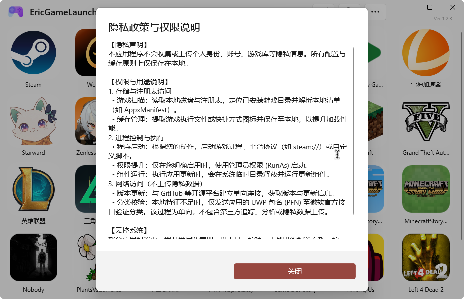
  <br/>
  <sub>Privacy and permissions: data stays local, and network access is limited to update checks and announcements</sub>
</div>


---

<a name="cli"></a>

## Command line: everything the desktop UI can do

`EricGameLauncher.Cli.exe` shares the same core logic as the desktop app, and both read and write the same data — a game added from the terminal appears in the interface right away.

```powershell
EricGameLauncher.Cli.exe list --json                 # print the library as JSON
EricGameLauncher.Cli.exe search yxlm                 # search by Pinyin initials
EricGameLauncher.Cli.exe launch --title "英雄联盟"     # launch a game
EricGameLauncher.Cli.exe scan --all --import         # scan and import in one go
EricGameLauncher.Cli.exe settings --set quickStart=true
```

| Command | Purpose |
| :--- | :--- |
| `list` | List the library or the Recycle Bin (`--recycle`), with `--json` support |
| `launch` / `platform` | Launch a game, app or platform manager; accepts `--admin` `--alt` `--alongside` |
| `add` / `edit` / `remove` | Add, edit or remove items (moved to the Recycle Bin by default) |
| `search` | Search by title, path, Pinyin or initials |
| `scan` | Scan Steam / Epic Games / Xbox with filtering, classification, import and invalid cleanup |
| `sort` / `recycle` / `restore` | Reordering, Recycle Bin management and restoring |
| `settings` | Read and modify every setting |
| `update` | Check, install or force-reinstall updates; `--history` prints the complete update history |
| `announcements` | Read cloud announcements and their read state |
| `install` / `uninstall` | Create or remove desktop and Start menu shortcuts |
| `storage` | Inspect or switch the data storage mode |
| `exit` | Stop the window and the background host (keeping the Quick Start setting) |
| `skill` | Print the built-in agent integration guide |

> Global options: `-help` for help, `--json` for structured output, `-debug` to switch to an isolated data and cache directory.
> Exit code `0` means success and `1` means failure, which makes scripting straightforward.

---

<a name="architecture"></a>

## Architecture

Every piece of business logic in **Eric Game Launcher** exists exactly once: both shells — the desktop interface and the console — share a single Core, with no parallel implementations.

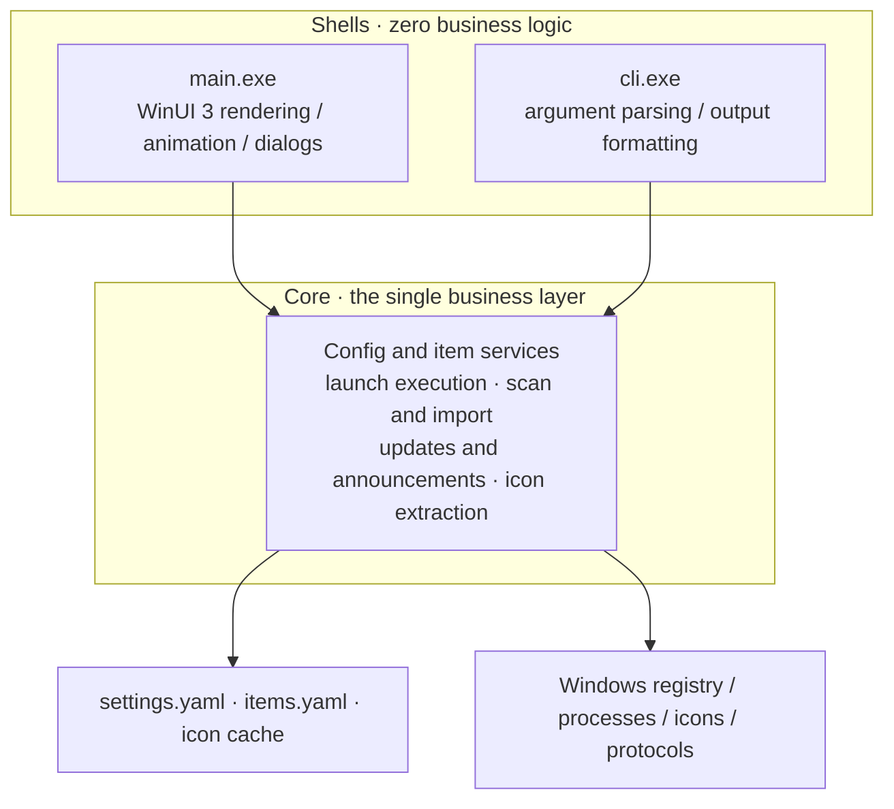

*   **Modern stack**: **Windows App SDK 1.8** + **WinUI 3** + **.NET 10**, using Mica / Acrylic materials and an adaptive grid.
*   **Single Core principle**: The desktop app and the CLI share one business layer, so features stay aligned and every operation is logged consistently.
*   **Human- and machine-readable configuration**: YAML (`YamlDotNet`) storage with `settings.yaml` and `items.yaml` kept separate, so frequent changes never rewrite everything.
*   **Native performance**: P/Invoke calls into system APIs handle icon extraction and caching, while window materials and the title bar are composed by the OS.
*   **Pinyin index**: `TinyPinyin` builds full-Pinyin and initial-letter indexes for titles in memory, so search responds with no delay.
*   **Secure storage**: The GitHub token is encrypted with DPAPI before it touches disk — never stored in plain text.
*   **Unpackaged distribution**: No MSIX packaging or certificate import — just a portable build you extract and run. Updates are applied from a temporary directory by embedded shadow components.
*   **Single instance and fast wake-up**: Win32 single-instance and message wake-up handling means launching again never opens a second window; it simply brings the existing one forward.

---

<a name="faq"></a>

## FAQ

<details>
<summary><b>Why is there an EricGameLauncher process in Task Manager after I sign in?</b></summary>

That is the Quick Start background host, which pre-reads configuration and warms up the interface so the next launch is almost instant. It collects no data and uploads nothing.

If you would rather not have it, turn off **Settings → Quick Start** and the auto-start entry is removed immediately; you can also end it at any time with **More → Exit**.
</details>

<details>
<summary><b>How do I exit completely instead of staying in the background?</b></summary>

Use **More → Exit** and both the window and the background host terminate, without changing the Quick Start setting. On Windows 11 24H2 and later you can also right-click the taskbar entry and choose "End task".
</details>

<details>
<summary><b>Does it need installing, and does it write to the registry?</b></summary>

No installation is required — extract and run. The only times it writes to the system are when Quick Start is enabled (registering sign-in auto-start) and when shortcuts are created (written to the Start menu or desktop). Game scanning reads local disks and the registry to locate installed games, but uploads nothing.
</details>

<details>
<summary><b>Where is my data stored?</b></summary>

System mode is the default, storing data in `%ProgramData%\eric\EricGameLauncher` (configuration and icon cache in separate locations). You can switch to portable mode to keep everything in a `Data` folder inside the program directory and take it with you. Migration between the two modes is one click.
</details>

<details>
<summary><b>Is Windows 10 supported?</b></summary>

No. Built on Windows App SDK 1.8 and WinUI 3, this project requires **Windows 11 24H2 (Build 26100)** or later.
</details>

---

## Contribution & Support

We welcome contributions of any kind — bug reports, documentation improvements or code (PRs).

*   Found a problem or have an idea? Open an [Issue](https://github.com/EricZhang233/EricGameLauncher/issues) with reproduction steps and it will be handled faster.
*   Want to get involved in development? The project builds with Visual Studio, and the desktop app and CLI share one Core, so a single change takes effect on both sides.

If you find this project helpful, please give it a heart-felt ⭐️ **Star**!

<a name="thanks"></a>

## Special Thanks / Links
*   [**Starward**](https://github.com/Scighost/Starward): A powerful Mihoyo game launcher. Our initial vision for this project was just a collection launcher for local games, with no plans to support distribution platforms. The reason we initially supported URL-scheme protocols was to support Starward's protocol for recording playtime in Mihoyo games. Later, we thought if we already support URL-schemes, why not support protocols from platforms like Steam/Epic Games? Thus, the current feature of supporting distribution platform launchers was born. Starward's innovation and contribution in the field of Mihoyo game launchers are indelible. We hope to pay tribute by supporting its protocol and provide players with more choices. With this opportunity, our launcher should support the vast majority of launcher URL-scheme protocols and parameterised execution.
*   [**Snap Hutao**](https://github.com/DGP-Studio/Snap.Hutao): Thanks to its team for their past outstanding contributions. It was the most powerful Genshin Impact toolbox I ever used. Although its curtain has closed, its open-source spirit will be passed on, inspiring those who follow. [**R.I.P**](https://hut.ao/)
*   [**Snap Hutao Remastered**](https://github.com/SnapHutaoRemasteringProject/Snap.Hutao.Remastered): A remaster of Snap Hutao. Dedicated to continuing the original features and revitalising them on a modern tech stack. Respect! This is also the toolbox I currently use when playing Genshin Impact.

## Friendly Links
*   [**TaskbarLyrics**](https://github.com/ANYNC/TaskbarLyrics): A genuinely useful taskbar lyrics tool, and another project I help maintain. The author listens to feedback, the features make sense, the details are polished, and its quality far exceeds similar projects.

---
<div align="center">
  Made with ❤️ by EricZhang233
</div>
