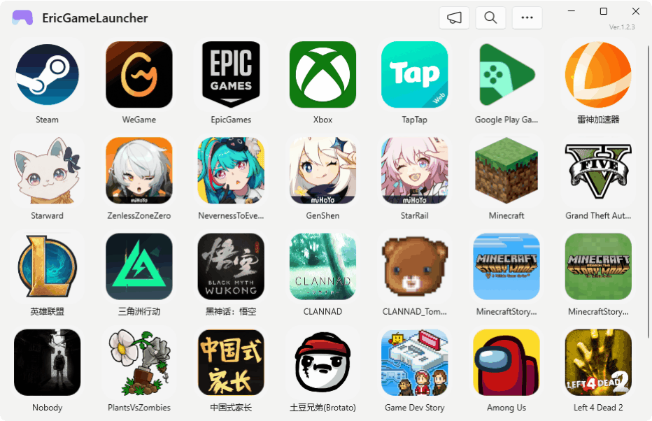
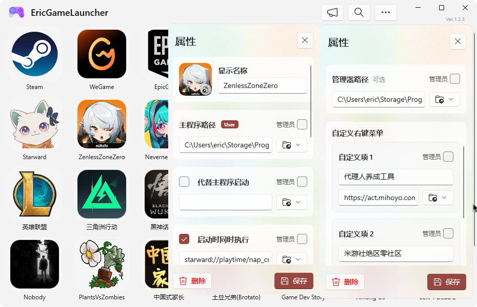
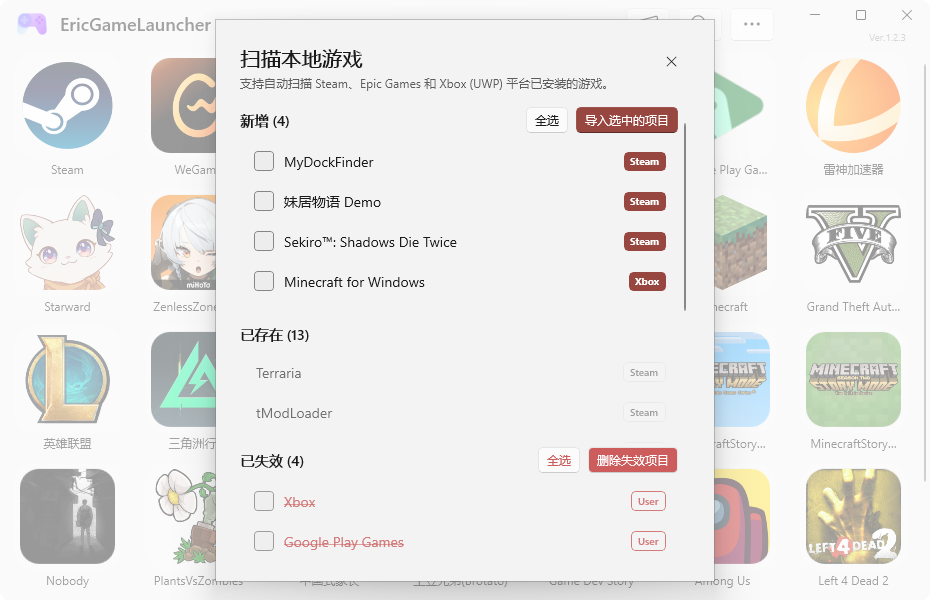
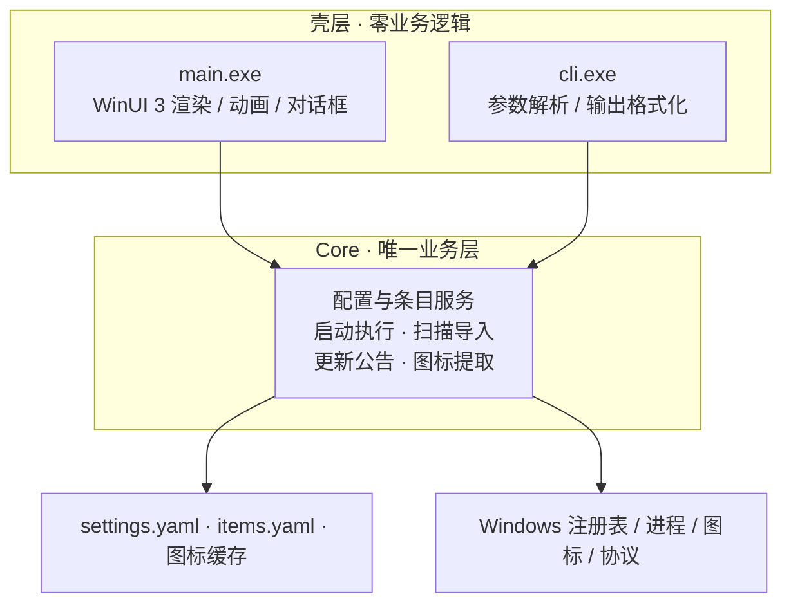

<!--
 readme编写规范：
  1. 所有readme都需要保留本说明且不可做任何翻译修改。主readme(中文版)是本说明的唯一源头(Source of Truth)，禁止将非中文版本中被修改的说明同步回主readme。非中文版的此说明需始终保持与主readme单向同步更新。
  2. 非中文版本的readme必须保留主readme(中文版)的所有视觉元素、HTML 标签、图标路径和排版格式，非中文版本的readme是中文版的完整对应精准同步翻译版，翻译不可笼统，不可修改原意，不可增减内容。
  3. 针对目标语言环境进行功能描述的本土化。
  4. 非中文版本的readme需要合理修改指向资源的路径，确保资源能够正确显示。
  5. 非中文版本的readme都需要保留并置顶本说明
  6. 非中文版本的readme都需要置顶以下元素，可以替换为相应的翻译版本但必须保留原意：
	    <div align="right">
	    <a href="../readme.md">For the latest updates, please refer to the Chinese README.</a>
	    </div>
  7. 任何关于项目内容的更新，必须首先在主readme(中文版)中完成。在主版确认无误后，再根据本规范同步至其他语言版本。
  8. 非中文版本的readme顶部的语言切换器仅保留指向主readme(中文版)的链接，不互相跳转。非中文版本的入口仅在主readme中统一显示。
-->

<div align="right">
  <a href=".github/readme_res/readme_en.md">English</a>
</div>
<div align="center">
  

# Eric Game Launcher

**让游戏启动回归纯粹与极速**

  
  
  

  [](https://dotnet.microsoft.com/)
  [](https://github.com/microsoft/microsoft-ui-xaml)
  [](https://www.microsoft.com/windows)
  [](https://www.gnu.org/licenses/gpl-3.0.html)

<a href="#highlights">亮点速览</a> • <a href="#quickstart">快速开始</a> • <a href="#features">功能详解</a> • <a href="#cli">命令行</a> • <a href="#settings">设置</a> • <a href="#architecture">技术架构</a> • <a href="#faq">常见问题</a> • <a href="#thanks">致谢</a>

<div align="center">
  
</div>
</div>

---

<a name="highlights"></a>

## 亮点速览

|  |  |
| :--- | :--- |
| 🚀 **毫秒级二次唤起** | 登录后由后台宿主预读配置、预热图标与界面，之后每次打开几乎瞬间出现；不需要时一键关闭，进程随即退出。 |
| 🧩 **全链路执行** | 主程序、管理器、代替启动、伴随执行、自定义右键菜单五路可配；EXE、快捷方式、URL 协议、网页、商店应用都能直接跑。 |
| 🗑️ **三段式删除** | 主界面删除只进回收站，回收站删除才开始 72 小时倒计时，到期后下次启动自动清理——手滑也救得回来。 |
| 🔍 **秒级定位游戏** | 拼音全拼、拼音首字母、中文、英文、路径多路匹配：`yxlm` 直达英雄联盟，`部落` 直达部落冲突。 |
| 🎒 **完全便携** | 配置与图标缓存可随程序走，塞进 U 盘即可随身携带；系统模式与便携模式之间一键迁移。 |
| 💻 **全功能 CLI** | 桌面端能做的命令行都能做，`-help` 与 `skill` 内置完整文档，脚本与 AI Agent 可直接接入。 |

<a name="quickstart"></a>

## 快速开始

### 环境要求

| 项目 | 要求 |
| :--- | :--- |
| 操作系统 | Windows 11 24H2（Build 26100）或更高版本，x64 |
| 运行依赖 | [.NET 10 桌面运行时](https://dotnet.microsoft.com/download/dotnet/10.0) 与 [Windows App Runtime 1.8](https://aka.ms/windowsappsdk/1.8/latest/windowsappruntimeinstall-x64.exe)，多数系统已具备，缺失时按提示安装 |
| 下载体积 | 不足 15 MB；程序自身免安装，解压即用 |

### 三步上手

1. **下载**：从 [Releases](https://github.com/EricZhang233/EricGameLauncher/releases) 取最新压缩包，解压到任意目录（路径含中文或空格都可以）。
2. **运行**：双击 `EricGameLauncher.exe`，首次启动自动完成初始化；需要桌面与开始菜单快捷方式就运行 `install.cmd`。
3. **入库**：点右上角 **更多 → 扫描** 自动识别本机游戏并一键导入，或用 **更多 → 添加** 手动指定 exe、快捷方式、网页、商店应用。

> 💡 想让它开得更快？**设置 → 快速启动** 打开后，登录即由后台预热，之后每次点开几乎瞬间出现。
>
> 💡 习惯命令行？`EricGameLauncher.Cli.exe -help` 看全部命令，`EricGameLauncher.Cli.exe skill` 取 Agent 接入文档。

---

<a name="features"></a>

## 功能详解

### 一屏收纳你的全部游戏

*   **不分平台**：Steam、Epic Games、Xbox、WeGame、独立 exe、网页链接、商店应用共用一个网格，顺序完全由你决定。
*   **图标可大可小**：从紧凑列表到沉浸大图连续可调，滑块即时生效，下次启动依旧保留。
*   **多路匹配**：`yxlm`（首字母）、`yingxionglianmeng`（全拼）、`部落`（中文）、`pcl`（路径）都能命中。
*   **手动排序**：**更多 → 排序** 里用移动按钮或 `W` `S` `↑` `↓` 调整顺序。
*   **悬停补全信息**：指针停留片刻即显示完整标题，长名字不必再猜。
*   **启动方式可选**：单击或双击启动，在设置里随时切换。

### 全链路执行：不止是快捷方式

配置一个游戏，等于配置一条完整的启动链路：

| 能力 | 说明 |
| :--- | :--- |
| **主程序** | 原生 `EXE`、`LNK` 快捷方式、`steam://` / `epic://` / `starward://` 等 URL 协议、网页链接、`shell:AppsFolder\` 商店应用，都可以作为启动目标。 |
| **以管理员身份运行** | 主程序与管理器分别提权，权限不足导致启动失败的问题迎刃而解。 |
| **管理器** | 单独指定平台管理器路径，确保游戏之外还能正确拉起平台服务。 |
| **代替主程序启动** | 用自定义命令（例如 `starward://`）完全接管原始 EXE 的启动逻辑。 |
| **启动时同时执行** | 翻译器、计时器、性能监控、按键映射随游戏一起启动，一键双开。 |
| **自定义右键菜单** | 单个项目最多 10 个自定义项，标题、命令、参数、是否提权各自独立；删掉中间项后自动补位。 |
| **参数与环境变量** | 所有执行目标都支持完整参数；`%AppData%`、`%LocalAppData%` 自动展开；带空格的长路径不必手动加引号。 |

### 快速启动：把等待压缩到看不见

*   **后台宿主**：登录后常驻宿主预读配置与条目、校验并重建图标、完整预热一次界面，再把界面释放掉，屏幕上不留任何窗口。
*   **再次打开几乎瞬间**：资源已经热好，窗口出现只需一瞬。
*   **动画可以关**：启动画面的渐入与渐出分别可关，关掉后直接显示或消失，启动更快。
*   **要彻底退出**：**更多 → 退出** 立刻结束界面与后台宿主，且不改动快速启动设置；Windows 11 24H2 及以上也可以在任务栏右键选择「结束任务」。
*   **不想要后台**：关掉开关，自启项随即移除。

### 属性面板：每个细节都能改

*   **名称与图标**：随时改名，也可以上传自己的图片当封面。
*   **四类执行目标分栏**：主程序、管理器、代替启动、伴随执行各自独立成行，都带文件选择与参数拆分。
*   **自定义菜单可视化编辑**：标题、命令、提权开关一列排开，最多 10 组。
*   **保存即刻生效**：确认后立即写回本地配置，界面同步刷新。

<div align="center">
  
  
  <br/>
  <sub>左：属性面板（可配置项一览）　右：扫描结果（新增 / 已存在 / 已失效）</sub>
</div>

### 一键扫描三大平台

*   **自动发现**：原生识别 Steam、Epic Games 与 Xbox（Microsoft Store / UWP）已安装游戏，提取路径并抓取图标。
*   **结果分组**：扫描结果按 **新增 / 已存在 / 已失效** 三组列出，已入库的项目不会重复导入。
*   **一键导入**：全选或逐项勾选后入库；Steam 协议游戏自动带上 `steam://` 启动地址。
*   **失效清理**：已卸载或路径失效的项目集中呈现，支持批量删除。

### 三段式删除：手滑也能救回来

| 阶段 | 行为 |
| :--- | :--- |
| 第一段 | 主界面删除 → 只移入回收站，游戏还在，随时可以还原。 |
| 第二段 | 回收站中删除 → 进入 72 小时倒计时，界面显示剩余时间。 |
| 第三段 | 倒计时结束 → 下次启动时自动彻底清理。 |

除了还原与永久删除，回收站也支持一键清空。

### 更新与公告

*   **静默检查更新**：启动时自动查询 GitHub Releases，有新版本时右上角版本号变红并出现更新图标，不做弹窗打扰。
*   **双通道**：**正式版** 只收正式发布，**开发版** 第一时间尝鲜。
*   **一键下载安装**：下载完成后自动重启替换；也可以随时强制重装。
*   **历史更新记录**：左侧版本列表、右侧完整说明，可跳转到任意版本，内容取自 GitHub 发布记录；命令行 `update --history` 同样可用。
*   **公告中心**：启动时拉取云端公告，正文支持 Markdown、中英双语，已读状态本地持久化，未读带红点提示。

<a name="settings"></a>

### 设置一览

*   **常规**：快速启动、启动动画（渐入 / 渐出）、启动方式（单击 / 双击）、启动后自动退出。
*   **更新**：更新通道（正式版 / 开发版）、GitHub 令牌（提高 API 限额；令牌以 DPAPI 加密后存于本地）。
*   **数据**：数据位置（便携 / 系统）一键迁移，并可快速打开配置目录与缓存目录。
*   **标题栏**：图标大小、排序、回收站、快捷方式创建与卸载、隐私与权限说明、检查更新。

每个设置项右侧都有「?」按钮：悬停查看说明，点击固定展开。

---

<a name="cli"></a>

## 命令行：桌面端有的，命令行全都有

`EricGameLauncher.Cli.exe` 与桌面端共享同一套核心逻辑，数据实时互通——在命令行里加的游戏，回到界面立刻就能看到。

```powershell
EricGameLauncher.Cli.exe list --json                 # 以 JSON 输出游戏库
EricGameLauncher.Cli.exe search yxlm                 # 拼音首字母搜索
EricGameLauncher.Cli.exe launch --title "英雄联盟"     # 启动游戏
EricGameLauncher.Cli.exe scan --all --import         # 扫描并一键导入
EricGameLauncher.Cli.exe settings --set quickStart=true
```

| 命令 | 用途 |
| :--- | :--- |
| `list` | 列出游戏库或回收站（`--recycle`），支持 `--json` |
| `launch` / `platform` | 启动游戏、应用或平台管理器，可指定 `--admin` `--alt` `--alongside` |
| `add` / `edit` / `remove` | 添加、编辑、删除项目（默认进回收站） |
| `search` | 按标题、路径、拼音或首字母检索 |
| `scan` | 扫描 Steam / Epic Games / Xbox，可筛选、分类、导入、清理失效项 |
| `sort` / `recycle` / `restore` | 排序、回收站管理、还原 |
| `settings` | 查看与修改全部设置项 |
| `update` | 检查、安装、强制重装更新，`--history` 输出完整更新历史 |
| `announcements` | 查看云端公告与已读状态 |
| `install` / `uninstall` | 创建或移除桌面与开始菜单快捷方式 |
| `storage` | 查看或切换数据存储模式 |
| `exit` | 结束界面与后台宿主（保留快速启动设置） |
| `skill` | 输出内置的 Agent 接入文档 |

> 全局参数：`-help` 查看帮助，`--json` 输出结构化结果，`-debug` 切换到独立的数据与缓存目录。
> 退出码 `0` 表示成功、`1` 表示失败，方便脚本判断。

---

<a name="architecture"></a>

## 技术架构

**Eric Game Launcher** 的每一行业务逻辑都只存在一份：两个壳层（桌面界面与控制台）共用同一个 Core，不存在平行实现。



*   **前沿技术栈**：**Windows App SDK 1.8** + **WinUI 3** + **.NET 10**，使用 Mica / 亚克力材质与自适应网格。
*   **单一 Core 原则**：桌面端与命令行共用业务层，功能天然对齐，日志统一记录。
*   **人机皆可读的配置**：YAML（`YamlDotNet`）存储，`settings.yaml` 与 `items.yaml` 分离，高频改动不必重写全部数据。
*   **原生性能**：P/Invoke 调用系统接口完成图标提取与缓存，窗口材质与标题栏交给系统合成。
*   **拼音索引**：`TinyPinyin` 在内存中为标题建立全拼与首字母索引，搜索零延迟。
*   **安全存储**：GitHub 令牌使用 DPAPI 加密后落盘，不写入明文。
*   **Unpackaged 发布**：无需 MSIX 打包与证书导入，解压即用的绿色版本；更新由内置影子组件在临时目录完成替换。
*   **单实例与快速唤醒**：Win32 单实例与消息唤醒机制保证重复启动不会开出多个窗口，而是直接唤起已有实例。

---

<a name="faq"></a>

## 常见问题

<details>
<summary><b>为什么登录后任务管理器里会有一个 EricGameLauncher 进程？</b></summary>

这是「快速启动」的后台宿主，用于预读配置与预热界面，让下次打开几乎瞬间完成。它不收集任何数据、不联网上传内容。

不想要的话，在 **设置 → 快速启动** 关闭即可，自启项会被立即移除；也可以随时通过 **更多 → 退出** 结束它。
</details>

<details>
<summary><b>怎么彻底退出，而不是留在后台？</b></summary>

打开 **更多 → 退出**，界面与后台宿主会一起结束，且不会改动快速启动设置。在 Windows 11 24H2 及以上，也可以直接在任务栏右键选择「结束任务」。
</details>

<details>
<summary><b>需要安装吗？会写注册表吗？</b></summary>

不需要安装，解压即用。只有在以下情况才会写入系统：开启快速启动（注册登录自启）、创建快捷方式（写入开始菜单 / 桌面）。游戏扫描会读取本地磁盘与注册表以定位已安装游戏，但不会上传任何信息。
</details>

<details>
<summary><b>我的数据存在哪里？</b></summary>

默认为系统模式，存放于 `%ProgramData%\eric\EricGameLauncher`（配置、图标缓存分开存放）；也可以切换到便携模式，把数据放进程序目录下的 `Data` 文件夹，随程序一起搬走。两种模式之间可以一键迁移。
</details>

<details>
<summary><b>支持 Windows 10 吗？</b></summary>

不支持。本项目基于 Windows App SDK 1.8 与 WinUI 3，需要 **Windows 11 24H2（Build 26100）** 或更高版本。
</details>

---

## 贡献与支持

我们欢迎任何形式的贡献——无论是提交 Bug、改进文档，还是提交代码（PR）。

*   发现异常或有功能建议？欢迎前往 [Issues](https://github.com/EricZhang233/EricGameLauncher/issues) 反馈，附上复现步骤会更快被处理。
*   想参与开发？项目使用 Visual Studio 构建，桌面端与命令行共享同一套 Core，改一处即可两端生效。

如果您觉得这个项目对您有帮助，请给它由衷的一颗 ⭐️ **Star**！

<a name="thanks"></a>

## 特别致谢
*   [**Starward**](https://github.com/Scighost/Starward): 一个功能强大的米哈游游戏启动器。我们最初的对此项目的构想只是一个本地游戏的集合启动器，没计划支持分发平台。一开始之所以支持url-scheme协议，就是因为需要支持他的协议来支持记录米家游戏游戏时长。后来想了想既然都支持了url-scheme了，那就支持一下诸如 Steam/Epic Games 等平台的协议吧，结果就有了现在这个支持分发平台启动器的功能。Starward在米哈游游戏启动器领域的创新和贡献是不可磨灭的，我们希望通过支持其协议来向其致敬，并为玩家提供更多选择。借由这个契机，我们的启动器应该能支持绝大部分的启动器url-scheme协议和带参执行。
*   [**胡桃工具箱 (Snap Hutao)**](https://github.com/DGP-Studio/Snap.Hutao)：感谢其团队曾经的卓越贡献。它是本人用过最强大的原神工具箱。虽已谢幕，但其开源精神将薪火相传，激励后来者前行。[**R.I.P**](https://hut.ao/)
*   [**胡桃工具箱重制版 (Snap Hutao Remastered)**](https://github.com/SnapHutaoRemasteringProject/Snap.Hutao.Remastered)：胡桃工具箱的重制版本。致力于延续原版的功能并在现代技术栈上焕发新生。致敬！也是我现在玩原神时使用的工具箱。

## 友情链接
*   [**TaskbarLyrics**](https://github.com/ANYNC/TaskbarLyrics): 一个相当好用的任务栏歌词软件，也是我参与维护的另一项目，作者听劝，功能合理，细节完善，质量远高于同类项目。

---
<div align="center">
  Made with ❤️ by EricZhang233
</div>
