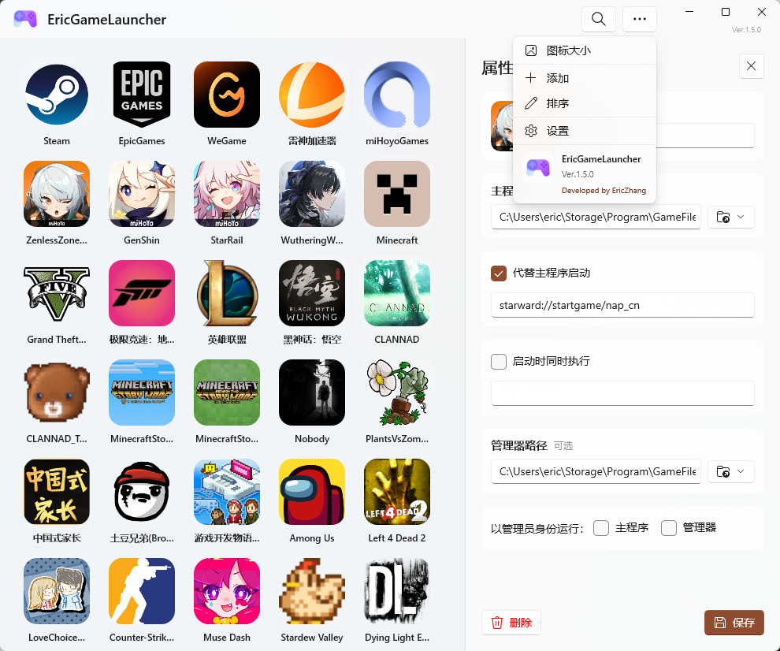

<!--
 readme编写规范：
  1. 所有readme都需要保留本说明且不可做任何翻译修改。主readme(中文版)是本说明的唯一源头(Source of Truth)，禁止将非中文版本中被修改的说明同步回主readme。非中文版的此说明需始终保持与主readme单向同步更新。
  2. 非中文版本的readme必须保留主readme(中文版)的所有视觉元素、HTML 标签、图标路径和排版格式，非中文版本的readme是中文版的完整对应精准同步翻译版，翻译不可笼统，不可修改原意，不可增减内容。
  3. 针对目标语言环境进行功能描述的本土化：英文版需强调符合英语使用习惯的搜索匹配方式（如首字母、空格分隔首字母 and CamelCase 匹配）。
  4. 非中文版本的readme需要合理修改指向资源的路径，确保资源能够正确显示。
  5. 非中文版本的readme都需要保留并置顶本说明
  6. 非中文版本的readme都需要置顶以下元素，可以替换为相应的翻译版本但必须保留原意：
	    

	    <a href="../readme.md">For the latest updates, please refer to the Chinese README.</a>
	    

  7. 任何关于项目内容的更新，必须首先在主readme(中文版)中完成。在主版确认无误后，再根据本规范同步至其他语言版本。
  8. 非中文版本的readme顶部的语言切换器仅保留指向主readme(中文版)的链接，不互相跳转。非中文版本的入口仅在主readme中统一显示。
-->

  <a href="../readme.md">For the latest updates, please refer to the Chinese README.</a>

  

# Eric Game Launcher

**Bring Game Launching Back to Purity and Speed**

[Features](#features) • [Technical Highlights](#technical-highlights) • [Quick Start](#quick-start) • [Contribution & Support](#contribution--support)

  
  

---

## Introduction

**Eric Game Launcher** is a next-generation game launcher built for minimalists. It discards the bloat of traditional platforms, leveraging the power of **WinUI 3** and **.NET 8** to provide millisecond-level startup experiences and native Windows 11 visual enjoyment.

Whether your games are from Steam, Epic, or independent exe files, this is their unified home.

## Features

### Built for Gamers
*   **Full-Link Execution Support**:
    *   **Multi-Dimensional Launching**: Complete life-cycle management covering "Main Program", "Manager", "Alternative Launch", "Alongside Execution", and "Custom Context Menu".
    *   **Full-Type Run Support**:
        *   **Web Support**: Directly supports web links, enabling one-click access to guides or official sites.
        *   **Native EXE/LNK**: Supports long paths with spaces, featuring a built-in smart argument splitting engine.
        *   **URL Protocol**: Perfectly matches `steam://`, `epic://`, `starward://`, etc., for platform-level interaction.
        *   **Windows Store Apps**: Supports launching apps via `shell:AppsFolder\` with optional elevation.
        *   **Environment Variables**: All paths support automatic expansion of variables like `%AppData%`.
*   **Ultra-Lightweight**: Start as needed, leave when done. No background services, zero ads, and system resource usage is nearly zero.
*   **Efficient Search**: Supports full Pinyin, Pinyin initials, English initials, space-separated initials, and uppercase letter matching search.  
*   **Professional-Grade Property Control**: This isn't just a basic shortcut.
    *   **Run as Administrator**: Separately configure elevation for the "Game Main Program" and "Game Manager", solving issues where insufficient permissions prevent startup.
    *   **Run Manager**: Supports configuring the manager path to ensure the game not only starts but also correctly triggers platform services.
    *   **Full Parameter Support**: All configured execution targets have end-to-end execution support.
    *   **Replace Main Executable**: Check this to use a custom command (e.g., `starward://`) to completely replace the original EXE's startup logic.
    *   **Execute Simultaneously on Startup**: Want to automatically open a translator, timer, or performance monitor when playing? Configure this for one-click dual launch.
    *   **Change Icon**: Supports manual image uploads for covers—a savior for those with OCD.
    *   **Custom Context Menu**: Add up to 10 custom menu items for each project.
        *   Independently configure titles, command paths, and arguments.
        *   Toggle "Run as Administrator" for each custom item.
        *   **Smart Shifting**: Subsequent items automatically shift up when an intermediate item is deleted to keep the list compact.
    *   **Icon Size**: From compact lists to immersive large grids, customize as you wish.
*   **Automatic Update Support**：
    *   **Built-in Update Check**: Automatically checks GitHub Releases on startup to ensure you are always using the latest version.  
    *   **Silent Notification**: When an update is available, the version number in the top-right corner turns red and displays an update icon — no intrusive pop-up alerts.  
    *   **One-Click Download**: New version detected? Download and install with a single click, no manual steps required.  

 ### Designed for Geeks
*   **Fully Portable Mode**: Supports storing all data (configurations, cached icons) in the program directory. Put it on a USB drive, carry your game library with you, and run it on any computer.
*   **Seamless Data Migration**: Want to switch from system installation mode to portable mode? One-click migration automatically moves all configurations and icons without reconfiguration.
*   **Smart Icon Extraction**: Automatically parses `.exe`, `.lnk`, and even Steam/Epic URL protocols to extract and cache high-definition icons.

## Technical Highlights

For developers, Eric Game Launcher demonstrates how to build modern Windows desktop applications with minimal code:

*   **Cutting-Edge Stack**: Built on the latest **Windows App SDK (1.6+)** and **.NET 8**, showcasing the great potential of WinUI 3 in desktop applications.
*   **Native Performance**:
    *   Utilizes `P/Invoke` (User32.dll) for efficient system-level icon extraction.
    *   Uses `System.Text.Json` for high-performance, low-memory data serialization.
*   **Clean Architecture**:
    *   **Efficient Data Binding**: Smooth UI interactions achieved through `ObservableCollection` and XAML binding, with clear and intuitive code logic.
    *   **Static Service Design**: Core modules like `ConfigService` and `I18n` use static classes for zero-overhead calls, remaining minimalist and efficient.
*   **Modern Build**:
    *   **Unpackaged Deployment**: Skips the tedious MSIX packaging and certificate importation, directly generating a green and pure `.exe` executable.

## Quick Start

### Users
1.  Go to the [Releases](../../releases) page and download the latest version.
2.  Extract and run `EricGameLauncher.exe`.
3.  Click **"More" -> "Add"** in the top right corner, then select a game shortcut or executable.

## Contribution & Support

We welcome any form of contribution! Whether it's submitting bugs, improving documentation, or submitting code (PRs).

If you find this project helpful, please give it a heart-felt ⭐️ **Star**!

## Special Thanks / Links
*   [**Starward**](https://github.com/Scighost/Starward): A powerful Mihoyo game launcher. Our initial vision for this project was just a collection launcher for local games, with no plans to support distribution platforms. The reason we initially supported URL-scheme protocols was to support Starward's protocol for recording playtime in Mihoyo games. Later, we thought if we already support URL-schemes, why not support protocols from platforms like Steam/Epic? Thus, the current feature of supporting distribution platform launchers was born. Starward's innovation and contribution in the field of Mihoyo game launchers are indelible. We hope to pay tribute by supporting its protocol and provide players with more choices. With this opportunity, our launcher should support the vast majority of launcher URL-scheme protocols and parameterised execution.
*   [**Snap Hutao**](https://github.com/DGP-Studio/Snap.Hutao): Thanks to its team for their past outstanding contributions. It was the most powerful Genshin Impact toolbox I ever used. Although its curtain has closed, its open-source spirit will be passed on, inspiring those who follow. [**R.I.P**](https://hut.ao/)
*   [**Snap Hutao Remastered**](https://github.com/SnapHutaoRemasteringProject/Snap.Hutao.Remastered): A remaster of Snap Hutao. Dedicated to continuing the original features and revitalising them on a modern tech stack. Respect! This is also the toolbox I currently use when playing Genshin Impact.

---

  Made with ❤️ by EricZhang233

